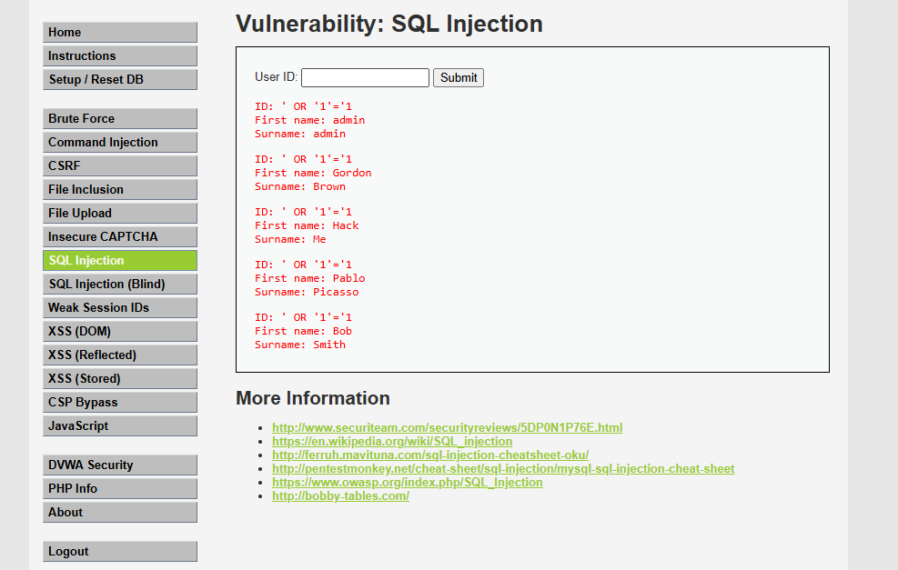

# Vulnerabilidad: SQL Injection

# Clínica Vista Hermosa

---

# 1. Identificación del Hallazgo

| Campo                        | Detalle                                                                         |
| ---------------------------- | ------------------------------------------------------------------------------- |
| Nombre de la vulnerabilidad  | SQL Injection                                                                   |
| Tipo de vulnerabilidad       | Inyección en aplicación web                                                     |
| Entorno de prueba            | DVWA                                                                            |
| Nivel de seguridad utilizado | Low                                                                             |
| Empresa evaluada             | Clínica Vista Hermosa                                                           |
| Rubro                        | Salud privada                                                                   |
| Activos afectados            | Base de datos clínica, fichas médicas, datos personales, resultados de exámenes |
| Severidad técnica estimada   | Crítica                                                                         |
| Riesgo para el negocio       | Crítico                                                                         |

---

# 2. Descripción General

La vulnerabilidad **SQL Injection** o **Inyección SQL** corresponde a una falla de seguridad presente en aplicaciones web que construyen consultas hacia una base de datos utilizando directamente información ingresada por el usuario, sin aplicar validación, sanitización ni separación adecuada entre datos e instrucciones SQL.

Esta vulnerabilidad permite que un atacante altere la lógica original de una consulta mediante la inserción de fragmentos de código SQL malicioso. Como consecuencia, la aplicación puede entregar información que no debería mostrar, modificar datos, eliminar registros o incluso permitir acceso no autorizado a funciones internas.

En el contexto de **Clínica Vista Hermosa**, esta vulnerabilidad resulta especialmente grave porque el portal de clientes administra información médica altamente sensible, incluyendo fichas clínicas, resultados de exámenes, diagnósticos, antecedentes de tratamientos y datos personales de pacientes.

Una falla de este tipo no solo representa un problema técnico, sino también un riesgo directo para la privacidad de los pacientes, la continuidad operacional de la clínica y la confianza institucional.

---

# 3. Objetivo de la Prueba

El objetivo de esta prueba fue demostrar que una entrada manipulada puede alterar el comportamiento normal de una consulta SQL y permitir el acceso no autorizado a registros almacenados en la base de datos.

La prueba se realizó en un entorno controlado y autorizado, utilizando DVWA como laboratorio académico. El propósito fue comprender el funcionamiento de la vulnerabilidad, obtener evidencia de explotación y analizar su impacto en una organización ficticia del sector salud.

---

# 4. Alcance de la Prueba

La prueba se limitó exclusivamente al módulo **SQL Injection** de DVWA.

No se realizaron acciones sobre sistemas reales, infraestructura productiva, servicios externos ni bases de datos con información verdadera de pacientes.

El análisis se desarrolló con fines defensivos y académicos, orientado a comprender cómo una vulnerabilidad técnica puede transformarse en un riesgo de negocio para una clínica privada.

---

# 5. Evidencia del Ataque

## 5.1 Payload utilizado

```sql
' OR '1'='1
```

## 5.2 Captura de evidencia



**Figura 1.** Evidencia de explotación SQL Injection en DVWA. Se observa el payload utilizado y la exposición de múltiples registros, demostrando que la consulta SQL fue manipulada exitosamente.

## 5.3 Resultado obtenido

Al ingresar el payload en el campo vulnerable, la aplicación retornó múltiples registros almacenados en la base de datos.

Este comportamiento demuestra que la condición original de búsqueda fue alterada, permitiendo que la consulta devolviera información que no correspondía únicamente al valor solicitado por el usuario.

En un portal real de Clínica Vista Hermosa, un comportamiento equivalente podría permitir que un atacante visualice registros de pacientes, fichas clínicas, diagnósticos, resultados de exámenes u otros antecedentes médicos de carácter confidencial.

---

# 6. Explicación Técnica

## 6.1 Funcionamiento normal esperado

Una aplicación web que consulta información en una base de datos normalmente construye una instrucción SQL para buscar un registro específico.

Por ejemplo, una consulta legítima podría tener una estructura similar a la siguiente:

```sql
SELECT * FROM pacientes
WHERE id = '1';
```

En este caso, la aplicación debería devolver únicamente el registro asociado al identificador indicado.

## 6.2 Funcionamiento vulnerable

El problema ocurre cuando la aplicación inserta directamente el dato ingresado por el usuario dentro de la consulta SQL, sin validar ni parametrizar la entrada.

Si el usuario ingresa el siguiente valor:

```sql
' OR '1'='1
```

la consulta puede transformarse en algo similar a:

```sql
SELECT * FROM pacientes
WHERE id = '' OR '1'='1';
```

La condición:

```sql
'1'='1'
```

siempre es verdadera.

Por lo tanto, la base de datos interpreta que la condición de búsqueda se cumple para todos los registros y devuelve más información de la permitida.

## 6.3 Causa raíz

La causa raíz de esta vulnerabilidad es la falta de separación entre:

* Los datos ingresados por el usuario.
* Las instrucciones SQL ejecutadas por el sistema.

Cuando una aplicación mezcla datos externos con instrucciones internas sin controles adecuados, permite que un atacante manipule la lógica de la consulta.

---

# 7. Clasificación de la Vulnerabilidad

SQL Injection se clasifica como una vulnerabilidad de tipo **inyección**.

Este tipo de falla se produce cuando información no confiable es enviada a un intérprete, en este caso el motor de base de datos SQL, como parte de una consulta o comando.

Desde el punto de vista de seguridad de aplicaciones, SQL Injection es una vulnerabilidad crítica porque ataca directamente la capa de datos, donde se almacena información esencial para el funcionamiento del negocio.

---

# 8. Activos Afectados

En Clínica Vista Hermosa, la explotación exitosa de SQL Injection podría comprometer los siguientes activos:

| Activo                        | Descripción                                                | Impacto Potencial                                      |
| ----------------------------- | ---------------------------------------------------------- | ------------------------------------------------------ |
| Base de datos clínica         | Repositorio central de información médica y administrativa | Exposición o modificación masiva de datos              |
| Fichas clínicas electrónicas  | Historial médico de pacientes                              | Vulneración de privacidad y posible alteración clínica |
| Resultados de exámenes        | Informes médicos y resultados de laboratorio               | Riesgo de acceso indebido o manipulación               |
| Datos personales de pacientes | Nombre, RUT, contacto y antecedentes asociados             | Robo de identidad o uso malicioso                      |
| Credenciales de usuarios      | Accesos de pacientes, médicos o administrativos            | Suplantación de identidad y acceso no autorizado       |

---

# 9. Impacto para Clínica Vista Hermosa

## 9.1 Impacto sobre la confidencialidad

La confidencialidad se vería gravemente afectada, ya que un atacante podría acceder a información médica sensible sin autorización.

Esto podría incluir:

* Diagnósticos.
* Tratamientos.
* Resultados de exámenes.
* Historiales médicos.
* Datos personales de pacientes.

La exposición de esta información dañaría directamente la privacidad de los pacientes y la confianza depositada en la clínica.

## 9.2 Impacto sobre la integridad

La integridad también podría verse comprometida si el atacante logra modificar registros de la base de datos.

En una institución de salud, alterar información clínica puede tener consecuencias graves, ya que los médicos podrían tomar decisiones basadas en datos incorrectos.

Ejemplos de afectación:

* Modificación de diagnósticos.
* Alteración de resultados de exámenes.
* Eliminación de antecedentes médicos.
* Cambios en datos administrativos o de contacto.

## 9.3 Impacto sobre la disponibilidad

La disponibilidad podría verse afectada si el atacante elimina registros, bloquea tablas, genera errores en la base de datos o interrumpe el funcionamiento normal del portal.

Esto podría impedir que pacientes y funcionarios accedan a información crítica en momentos necesarios.

---

# 10. Escenario de Riesgo para el Negocio

Un escenario posible sería que un atacante utilice el formulario vulnerable del portal de clientes para manipular consultas SQL y obtener información de múltiples pacientes.

A partir de esta información, el atacante podría:

* Filtrar datos médicos.
* Realizar extorsión contra la clínica.
* Suplantar pacientes o funcionarios.
* Vender información en mercados ilícitos.
* Realizar ataques posteriores usando credenciales obtenidas.
* Generar daño reputacional mediante publicación de información sensible.

Este escenario representa un riesgo crítico debido a que afecta simultáneamente la confidencialidad, integridad y disponibilidad de la información.

---

# 11. Evaluación CVSS

## 11.1 Métrica Base Utilizada

| Métrica             | Valor     | Justificación                                                                                               |
| ------------------- | --------- | ----------------------------------------------------------------------------------------------------------- |
| Attack Vector       | Network   | La vulnerabilidad puede explotarse mediante una aplicación web accesible por red                            |
| Attack Complexity   | Low       | El ataque requiere una entrada simple y conocida                                                            |
| Privileges Required | None      | En el escenario evaluado no se requieren privilegios administrativos para explotar el formulario vulnerable |
| User Interaction    | None      | No se necesita interacción de otra víctima                                                                  |
| Scope               | Unchanged | El impacto ocurre dentro del mismo componente vulnerable                                                    |
| Confidentiality     | High      | Puede exponer información médica sensible                                                                   |
| Integrity           | High      | Puede permitir alteración de registros                                                                      |
| Availability        | High      | Puede afectar la disponibilidad de la base de datos                                                         |

## 11.2 Vector CVSS

```text
CVSS:3.1/AV:N/AC:L/PR:N/UI:N/S:U/C:H/I:H/A:H
```

## 11.3 Puntaje CVSS

```text
9.8 / 10
```

## 11.4 Severidad

```text
CRÍTICA
```

## 11.5 Observación sobre el contexto

Aunque en el laboratorio DVWA se utiliza una sesión de acceso para realizar la actividad, la evaluación considera el riesgo de una funcionalidad vulnerable expuesta en un portal de clientes. En un escenario donde solo usuarios autenticados puedan ejecutar el ataque, el puntaje técnico podría disminuir; sin embargo, el riesgo de negocio seguiría siendo crítico debido a la sensibilidad de los datos clínicos involucrados.

---

# 12. Relación con la Matriz de Riesgo

| Elemento                 | Evaluación     |
| ------------------------ | -------------- |
| Probabilidad             | 5 - Muy Alta   |
| Impacto                  | 5 - Muy Alto   |
| Resultado                | 25             |
| Nivel de riesgo          | Crítico        |
| Prioridad de tratamiento | Alta prioridad |

La probabilidad se considera muy alta debido a que el ataque fue ejecutado exitosamente con un payload simple. El impacto se considera muy alto porque la explotación podría comprometer información médica sensible y afectar la operación de la clínica.

---

# 13. Políticas de Prevención

Las políticas de prevención buscan eliminar o reducir la causa raíz de la vulnerabilidad.

## 13.1 Uso obligatorio de consultas parametrizadas

Toda interacción con bases de datos debe realizarse mediante consultas parametrizadas o prepared statements. Esto evita que los datos ingresados por el usuario sean interpretados como instrucciones SQL.

Ejemplo conceptual seguro:

```sql
SELECT * FROM pacientes
WHERE id = ?;
```

En este caso, el valor ingresado por el usuario se trata como dato y no como parte de la instrucción SQL.

## 13.2 Validación estricta de entradas

La aplicación debe validar que los datos ingresados cumplan con el formato esperado.

Ejemplos:

* Si se espera un número, aceptar solo números.
* Si se espera un RUT, validar formato permitido.
* Si se espera un correo, validar estructura de correo electrónico.
* Limitar longitud máxima de campos.

## 13.3 Sanitización de entradas

Aunque la sanitización no reemplaza a las consultas parametrizadas, puede complementar la protección eliminando caracteres inesperados o peligrosos en ciertos campos.

## 13.4 Principio de menor privilegio

La cuenta de base de datos utilizada por la aplicación no debe tener permisos administrativos.

Debe contar únicamente con los privilegios necesarios para realizar sus funciones.

Por ejemplo:

* Permitir solo lectura cuando corresponda.
* Restringir eliminación de tablas.
* Evitar uso de cuentas root o administradoras.
* Separar cuentas por módulo o servicio.

## 13.5 Revisión segura de código

Todo cambio en módulos que interactúen con bases de datos debe pasar por revisión de seguridad antes de ser desplegado.

La revisión debe verificar:

* Uso de consultas parametrizadas.
* Validación de entradas.
* Manejo seguro de errores.
* Ausencia de concatenación directa de SQL.

---

# 14. Controles de Mitigación

Los controles de mitigación buscan reducir el impacto si la vulnerabilidad existe o si ocurre un intento de explotación.

## 14.1 Web Application Firewall

Implementar un WAF para detectar y bloquear patrones comunes de SQL Injection.

Este control no reemplaza la corrección del código, pero permite reducir intentos de explotación mientras se aplican medidas definitivas.

## 14.2 Monitoreo de consultas sospechosas

Registrar y monitorear consultas anómalas o patrones como:

* Uso repetido de comillas.
* Condiciones siempre verdaderas.
* Intentos de unión de consultas.
* Errores SQL frecuentes.
* Accesos masivos a registros.

## 14.3 Gestión de logs

Mantener registros de auditoría con información suficiente para investigar incidentes.

Los logs deben incluir:

* Usuario.
* Fecha y hora.
* Dirección IP.
* Recurso consultado.
* Error generado.
* Acción realizada.

## 14.4 Segmentación de base de datos

La base de datos clínica debe encontrarse segmentada respecto de otros servicios, reduciendo la posibilidad de movimiento lateral si un componente es comprometido.

## 14.5 Respaldos periódicos

Mantener respaldos actualizados y verificados de la base de datos clínica.

Los respaldos permiten recuperar información en caso de eliminación, corrupción o alteración de registros.

## 14.6 Alertas automáticas

Configurar alertas frente a eventos de alto riesgo, tales como:

* Aumento inusual de consultas.
* Errores SQL repetidos.
* Acceso a gran cantidad de registros.
* Consultas ejecutadas fuera de horario normal.
* Intentos de acceso desde ubicaciones inusuales.

---

# 15. Marcos de Referencia Aplicables

Las medidas propuestas se alinean con buenas prácticas de seguridad recomendadas por marcos reconocidos de la industria.

## 15.1 OWASP

OWASP clasifica las fallas de inyección como uno de los riesgos más relevantes en aplicaciones web. Las recomendaciones principales incluyen validar entradas, utilizar consultas parametrizadas y evitar la construcción dinámica insegura de consultas.

## 15.2 NIST

Las buenas prácticas de NIST promueven la identificación, protección, detección, respuesta y recuperación frente a incidentes de ciberseguridad. En este caso, los controles propuestos apoyan especialmente las funciones de protección, detección y respuesta.

## 15.3 CIS Controls

Los controles CIS promueven la gestión segura de vulnerabilidades, control de accesos, monitoreo de logs, protección de datos y configuración segura de sistemas.

---

# 16. Recomendaciones Técnicas

Para corregir esta vulnerabilidad se recomienda:

1. Reemplazar consultas dinámicas por consultas parametrizadas.
2. Eliminar concatenación directa de entradas de usuario en SQL.
3. Validar todos los campos de entrada.
4. Aplicar listas blancas cuando el campo tenga valores esperados.
5. Restringir permisos de la cuenta de base de datos.
6. Implementar monitoreo de errores SQL.
7. Configurar alertas ante patrones sospechosos.
8. Realizar pruebas de seguridad después de cada corrección.
9. Documentar la vulnerabilidad y su remediación.
10. Capacitar al equipo de desarrollo en codificación segura.

---

# 17. Plan de Acción Propuesto

| Prioridad | Acción                                                        | Responsable sugerido           | Plazo         |
| --------- | ------------------------------------------------------------- | ------------------------------ | ------------- |
| Alta      | Reemplazar consultas vulnerables por consultas parametrizadas | Equipo de desarrollo           | Inmediato     |
| Alta      | Validar entradas en formularios críticos                      | Equipo de desarrollo           | Corto plazo   |
| Alta      | Reducir privilegios de la cuenta de base de datos             | Administrador de base de datos | Corto plazo   |
| Media     | Implementar reglas WAF contra SQL Injection                   | Equipo TI / Seguridad          | Corto plazo   |
| Media     | Activar monitoreo y alertas                                   | Equipo TI / Seguridad          | Mediano plazo |
| Media     | Realizar pruebas periódicas                                   | Auditoría / Seguridad          | Permanente    |

---

# 18. Evidencia Esperada para la Entrega

Para cumplir adecuadamente con la evaluación, la evidencia debe mostrar:

* Módulo SQL Injection de DVWA.
* Payload ingresado.
* Resultado obtenido.
* Registros retornados por la aplicación.
* Captura propia guardada como `sqli_anajul.png`.
* Imagen insertada en la carpeta `docs_anajul/img_anajul/`.

Ruta esperada:

```text
docs_anajul/img_anajul/sqli_anajul.png
```

Referencia dentro del Markdown:

```markdown

```

---

# 19. Conclusión

SQL Injection representa una de las vulnerabilidades más críticas para aplicaciones web que interactúan con bases de datos.

En el caso de Clínica Vista Hermosa, la explotación exitosa de esta vulnerabilidad podría permitir acceso no autorizado a información médica confidencial, comprometiendo fichas clínicas, diagnósticos, resultados de exámenes, datos personales y credenciales de usuarios.

El impacto de esta falla es especialmente grave debido al rubro de la organización, ya que la información médica requiere altos niveles de confidencialidad, integridad y disponibilidad.

La mitigación de esta vulnerabilidad debe ser considerada una prioridad inmediata. La organización debe implementar consultas parametrizadas, validación estricta de entradas, principio de menor privilegio, monitoreo de consultas y controles de detección para reducir tanto la probabilidad de explotación como el impacto de un incidente.

Desde una perspectiva de negocio, esta vulnerabilidad representa un riesgo crítico para la continuidad operacional, el cumplimiento de buenas prácticas de seguridad y la confianza de los pacientes en la institución.
