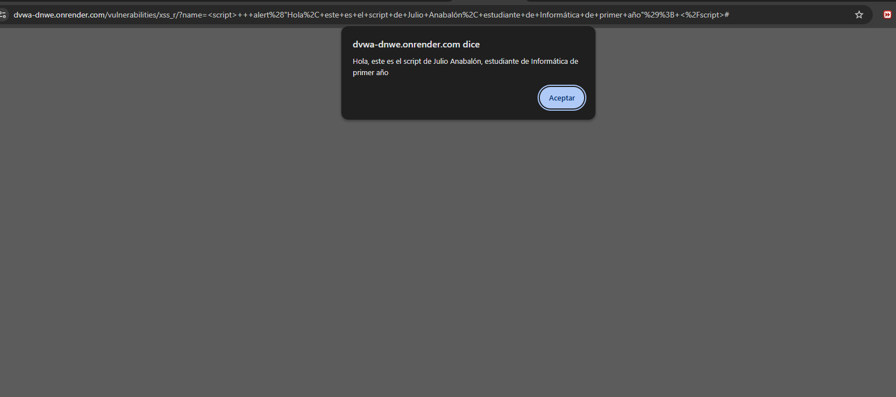

# Vulnerabilidad: Cross Site Scripting Reflected

# Clínica Vista Hermosa

---

# 1. Identificación del Hallazgo

| Campo                        | Detalle                                                                  |
| ---------------------------- | ------------------------------------------------------------------------ |
| Nombre de la vulnerabilidad  | Cross Site Scripting Reflected                                           |
| Sigla                        | XSS Reflected                                                            |
| Tipo de vulnerabilidad       | Inyección de código en navegador                                         |
| Entorno de prueba            | DVWA                                                                     |
| Nivel de seguridad utilizado | Low                                                                      |
| Empresa evaluada             | Clínica Vista Hermosa                                                    |
| Rubro                        | Salud privada                                                            |
| Activos afectados            | Portal de pacientes, sesiones de usuario, credenciales, datos personales |
| Severidad técnica estimada   | Media                                                                    |
| Riesgo para el negocio       | Alto                                                                     |

---

# 2. Descripción General

**Cross Site Scripting (XSS)** es una vulnerabilidad de aplicaciones web que permite a un atacante insertar código JavaScript dentro de una página que será interpretada y ejecutada por el navegador de un usuario.

En el caso de **XSS Reflected**, el código malicioso no queda almacenado permanentemente en la aplicación, sino que se refleja inmediatamente como parte de la respuesta del servidor. Esto ocurre cuando la aplicación recibe un dato ingresado por el usuario y lo devuelve en la página sin validarlo ni codificarlo correctamente.

Esta vulnerabilidad afecta principalmente a los usuarios del sistema, ya que el código se ejecuta en el navegador de la víctima. Aunque técnicamente no compromete directamente la base de datos como SQL Injection, puede facilitar ataques graves como robo de sesiones, suplantación de identidad, manipulación del contenido mostrado y redirección a sitios falsos.

En el contexto de **Clínica Vista Hermosa**, esta vulnerabilidad representa un riesgo importante debido a que el portal de clientes podría ser utilizado por pacientes, médicos, personal administrativo y funcionarios con acceso a información clínica sensible.

---

# 3. Objetivo de la Prueba

El objetivo de esta prueba fue demostrar que la aplicación vulnerable permite ejecutar código JavaScript enviado por el usuario, debido a la ausencia de controles adecuados de validación de entrada y codificación de salida.

La prueba busca evidenciar cómo una entrada aparentemente simple puede transformarse en una instrucción ejecutada por el navegador, generando un riesgo para la seguridad de los usuarios y la información administrada por la clínica.

---

# 4. Alcance de la Prueba

La prueba fue realizada exclusivamente en el módulo **XSS Reflected** de DVWA, dentro de un entorno controlado y autorizado.

No se realizaron ataques contra usuarios reales, sistemas productivos ni infraestructura externa.

La demostración se limitó a la ejecución de una alerta JavaScript simple, sin robo de información, sin captura de credenciales y sin afectación real a terceros.

---

# 5. Evidencia del Ataque

## 5.1 Payload utilizado

```html
<script>alert('XSS')</script>
```

## 5.2 Captura de evidencia



**Figura 2.** Evidencia de explotación XSS Reflected en DVWA. Se observa la ejecución de código JavaScript en el navegador mediante una entrada no validada.

## 5.3 Resultado obtenido

Al ingresar el payload en el campo vulnerable, el navegador interpretó el contenido como código JavaScript y ejecutó una ventana emergente.

Este resultado demuestra que la aplicación recibe información del usuario y la devuelve en la respuesta HTML sin aplicar controles adecuados de validación, filtrado o codificación.

En una aplicación real, el mismo principio podría ser utilizado para ejecutar acciones más dañinas contra usuarios autenticados en el portal de Clínica Vista Hermosa.

---

# 6. Explicación Técnica

## 6.1 Funcionamiento esperado

En una aplicación segura, cuando un usuario ingresa texto en un formulario, la aplicación debe tratar ese contenido únicamente como datos.

Por ejemplo, si un paciente escribe su nombre en un campo, el sistema debería mostrarlo como texto normal:

```text
Juan Pérez
```

El navegador no debería interpretar esa entrada como código ejecutable.

## 6.2 Funcionamiento vulnerable

Cuando la aplicación no valida ni codifica correctamente la salida, un atacante puede ingresar código HTML o JavaScript.

Por ejemplo:

```html
<script>alert('XSS')</script>
```

Si la aplicación devuelve ese contenido directamente en la página, el navegador interpreta la etiqueta `<script>` como una instrucción válida y ejecuta el código.

Esto ocurre porque el navegador no distingue por sí solo si el contenido fue escrito por un usuario legítimo o por un atacante. Si el servidor lo entrega como parte del HTML, el navegador lo procesa.

## 6.3 Causa raíz

La causa raíz de esta vulnerabilidad es la falta de controles en dos puntos principales:

* **Validación de entrada:** la aplicación acepta contenido potencialmente peligroso.
* **Codificación de salida:** la aplicación devuelve el contenido sin convertir caracteres especiales en texto seguro.

Caracteres como:

```html
< > " ' /
```

pueden cambiar el significado del contenido dentro de una página HTML si no son tratados correctamente.

---

# 7. Clasificación de la Vulnerabilidad

XSS Reflected se clasifica como una vulnerabilidad de inyección del lado del cliente.

A diferencia de SQL Injection, donde la inyección afecta una consulta hacia la base de datos, en XSS el código malicioso se ejecuta en el navegador del usuario.

Esta vulnerabilidad compromete principalmente:

* Sesiones de usuario.
* Cookies.
* Credenciales.
* Confianza en el sitio web.
* Integridad del contenido mostrado.
* Seguridad del navegador del usuario.

---

# 8. Escenario de Ataque Real

En un escenario real, un atacante podría construir un enlace malicioso que contenga el payload XSS y enviarlo a una víctima mediante correo electrónico, mensajería o una página externa.

Por ejemplo, un paciente o funcionario podría recibir un enlace aparentemente legítimo hacia el portal de Clínica Vista Hermosa. Al abrirlo, el navegador ejecutaría el código malicioso incluido en la URL o en el parámetro vulnerable.

La demostración con `alert('XSS')` solo confirma la ejecución de JavaScript. En un ataque real, el código podría utilizarse para acciones como:

* Manipular el contenido mostrado en el portal.
* Redirigir a la víctima a una página falsa.
* Forzar acciones dentro de la sesión activa.
* Capturar información escrita en formularios.
* Facilitar ataques de phishing.
* Engañar al usuario para entregar credenciales.

En esta auditoría no se ejecutan scripts dañinos, ya que el objetivo es únicamente defensivo y académico.

---

# 9. Activos Afectados

| Activo                      | Descripción                                       | Impacto Potencial                                |
| --------------------------- | ------------------------------------------------- | ------------------------------------------------ |
| Portal de pacientes         | Plataforma web usada por pacientes y funcionarios | Pérdida de confianza y manipulación de contenido |
| Sesiones de usuario         | Identifican a usuarios autenticados               | Riesgo de secuestro o uso indebido de sesión     |
| Credenciales de acceso      | Permiten ingreso al portal                        | Suplantación de identidad                        |
| Datos personales            | Información identificatoria de pacientes          | Exposición o uso indebido                        |
| Información clínica visible | Datos mostrados al usuario autenticado            | Acceso no autorizado indirecto                   |
| Navegador del usuario       | Medio donde se ejecuta el script                  | Ejecución de código no autorizado                |

---

# 10. Impacto para Clínica Vista Hermosa

## 10.1 Impacto sobre la confidencialidad

La confidencialidad podría verse afectada si el atacante logra acceder a información visible dentro de la sesión de un usuario legítimo.

En una clínica, esto puede incluir:

* Datos personales de pacientes.
* Resultados de exámenes.
* Información de citas médicas.
* Diagnósticos visibles en el portal.
* Datos administrativos asociados a prestaciones de salud.

Aunque XSS Reflected no entrega acceso directo a toda la base de datos, puede actuar como una vía para comprometer cuentas legítimas y obtener información sensible a través del navegador de la víctima.

## 10.2 Impacto sobre la integridad

La integridad puede verse afectada si el atacante modifica el contenido presentado en pantalla o induce al usuario a realizar acciones incorrectas.

Ejemplos:

* Mostrar información falsa en el portal.
* Alterar visualmente instrucciones médicas.
* Redirigir al usuario a formularios falsos.
* Manipular mensajes o advertencias del sistema.

En una institución de salud, la confianza en la información mostrada por el portal es fundamental.

## 10.3 Impacto sobre la disponibilidad

El impacto sobre la disponibilidad suele ser menor que en SQL Injection o Command Injection. Sin embargo, un ataque XSS podría degradar la experiencia de uso, provocar errores en la interfaz o impedir temporalmente el uso normal de ciertas páginas del portal.

---

# 11. Riesgo para el Negocio

Desde la perspectiva de Clínica Vista Hermosa, XSS Reflected representa un riesgo alto porque afecta directamente la confianza del usuario en el portal.

Un incidente de este tipo podría generar:

* Pérdida de confianza de pacientes.
* Robo o compromiso de cuentas.
* Suplantación de usuarios.
* Daño reputacional.
* Aumento de reclamos y solicitudes de soporte.
* Posibles investigaciones internas.
* Necesidad de notificar incidentes de seguridad.

El riesgo aumenta si usuarios con privilegios, como médicos o personal administrativo, acceden al enlace malicioso mientras mantienen una sesión activa en el portal.

---

# 12. Evaluación CVSS

## 12.1 Métrica Base Utilizada

| Métrica             | Valor    | Justificación                                                                                        |
| ------------------- | -------- | ---------------------------------------------------------------------------------------------------- |
| Attack Vector       | Network  | El ataque puede ejecutarse mediante una aplicación web accesible por red                             |
| Attack Complexity   | Low      | El payload es simple y fácil de construir                                                            |
| Privileges Required | None     | No requiere privilegios previos para enviar el enlace o utilizar el formulario vulnerable            |
| User Interaction    | Required | La víctima debe acceder al enlace o interactuar con la página vulnerable                             |
| Scope               | Changed  | El impacto se produce en el navegador del usuario, fuera del control directo del servidor vulnerable |
| Confidentiality     | Low      | Puede exponer información disponible en la sesión del usuario                                        |
| Integrity           | Low      | Puede modificar o manipular contenido mostrado a la víctima                                          |
| Availability        | None     | No afecta directamente la disponibilidad del servidor                                                |

## 12.2 Vector CVSS

```text
CVSS:3.1/AV:N/AC:L/PR:N/UI:R/S:C/C:L/I:L/A:N
```

## 12.3 Puntaje CVSS

```text
6.1 / 10
```

## 12.4 Severidad

```text
MEDIA
```

## 12.5 Observación sobre el contexto

Aunque el puntaje CVSS técnico corresponde a severidad media, el impacto de negocio para Clínica Vista Hermosa se considera alto debido a la sensibilidad de la información médica y al riesgo de comprometer sesiones de pacientes, médicos o funcionarios administrativos.

Esto demuestra que la severidad técnica y el riesgo de negocio no siempre son equivalentes. En una clínica privada, incluso una vulnerabilidad técnicamente media puede tener consecuencias importantes si afecta usuarios con acceso a información sensible.

---

# 13. Relación con la Matriz de Riesgo

| Elemento                 | Evaluación  |
| ------------------------ | ----------- |
| Probabilidad             | 4 - Alta    |
| Impacto                  | 4 - Alto    |
| Resultado                | 16          |
| Nivel de riesgo          | Alto        |
| Prioridad de tratamiento | Prioritaria |

La probabilidad se considera alta porque el ataque puede ejecutarse con un payload simple y distribuirse mediante enlaces. El impacto se considera alto debido al posible compromiso de sesiones, credenciales y datos visibles en el portal.

---

# 14. Políticas de Prevención

Las políticas de prevención buscan eliminar la causa raíz de la vulnerabilidad.

## 14.1 Validación de entradas

Toda entrada del usuario debe ser validada antes de ser procesada por la aplicación.

La validación debe considerar:

* Longitud máxima permitida.
* Tipo de dato esperado.
* Caracteres permitidos.
* Rechazo de etiquetas HTML no autorizadas.
* Uso de listas blancas cuando sea posible.

## 14.2 Codificación de salida

Todo contenido ingresado por usuarios debe ser codificado antes de mostrarse en una página HTML.

Por ejemplo, caracteres como `<` y `>` deben mostrarse como texto, no interpretarse como etiquetas HTML.

Esto permite que un payload como:

```html
<script>alert('XSS')</script>
```

se muestre como texto y no se ejecute como código.

## 14.3 Uso de frameworks seguros

Utilizar frameworks modernos que aplican protección automática contra XSS cuando se usan correctamente.

Sin embargo, el uso de un framework no elimina por completo el riesgo si el desarrollador utiliza funciones inseguras para insertar HTML sin validar.

## 14.4 Content Security Policy

Implementar una política CSP para restringir la ejecución de scripts no autorizados.

Una CSP bien configurada puede reducir el impacto de XSS al impedir la ejecución de código inline o scripts externos no autorizados.

## 14.5 Prohibición de HTML no controlado

La aplicación debe evitar renderizar contenido HTML ingresado por usuarios, salvo que exista una necesidad justificada y controles estrictos de sanitización.

---

# 15. Controles de Mitigación

Los controles de mitigación reducen el impacto en caso de que exista una vulnerabilidad o se produzca un intento de explotación.

## 15.1 Cookies con HttpOnly

Configurar cookies de sesión con el atributo `HttpOnly` para impedir que JavaScript acceda directamente a ellas.

## 15.2 Cookies con Secure

Configurar cookies con el atributo `Secure`, asegurando que solo sean transmitidas mediante conexiones HTTPS.

## 15.3 Cookies con SameSite

Aplicar el atributo `SameSite` para reducir riesgos relacionados con envío no deseado de cookies en solicitudes externas.

## 15.4 Expiración de sesiones

Configurar tiempos de expiración razonables para sesiones inactivas, especialmente en cuentas de médicos y personal administrativo.

## 15.5 Renovación de sesión después del login

Regenerar identificadores de sesión después de iniciar sesión para reducir riesgos de fijación de sesión.

## 15.6 Monitoreo de actividad sospechosa

Registrar intentos de uso de etiquetas HTML, scripts, parámetros anómalos o errores asociados a entradas no válidas.

## 15.7 Alertas de seguridad

Generar alertas frente a patrones sospechosos como:

* Uso repetido de `<script>`.
* Parámetros con eventos JavaScript.
* Intentos de carga de recursos externos.
* Redirecciones no autorizadas.
* Accesos desde ubicaciones inusuales.

---

# 16. Marcos de Referencia Aplicables

## 16.1 OWASP

OWASP reconoce XSS como una vulnerabilidad relevante en aplicaciones web y recomienda medidas como codificación de salida, validación de entradas, uso de CSP y gestión segura de sesiones.

## 16.2 NIST

Las buenas prácticas de NIST promueven controles para proteger, detectar, responder y recuperarse ante incidentes. Para XSS, resultan especialmente relevantes las funciones de protección y detección.

## 16.3 CIS Controls

Los controles CIS apoyan la implementación de monitoreo, gestión segura de aplicaciones, control de accesos y protección de navegadores y sesiones.

---

# 17. Recomendaciones Técnicas

Para corregir y reducir el riesgo de XSS Reflected se recomienda:

1. Validar todos los campos de entrada.
2. Aplicar codificación de salida en todo contenido mostrado al usuario.
3. Implementar Content Security Policy.
4. Evitar renderizar HTML ingresado por usuarios.
5. Configurar cookies con `HttpOnly`, `Secure` y `SameSite`.
6. Establecer expiración automática de sesiones.
7. Monitorear intentos de inyección de scripts.
8. Realizar pruebas de seguridad periódicas.
9. Capacitar al equipo de desarrollo en prevención de XSS.
10. Revisar formularios, parámetros de URL y mensajes reflejados por la aplicación.

---

# 18. Plan de Acción Propuesto

| Prioridad | Acción                                                        | Responsable sugerido                   | Plazo         |
| --------- | ------------------------------------------------------------- | -------------------------------------- | ------------- |
| Alta      | Implementar codificación de salida en formularios vulnerables | Equipo de desarrollo                   | Inmediato     |
| Alta      | Validar entradas de usuario mediante listas blancas           | Equipo de desarrollo                   | Corto plazo   |
| Alta      | Configurar CSP restrictiva                                    | Equipo de desarrollo / Seguridad       | Corto plazo   |
| Media     | Configurar cookies seguras                                    | Equipo de desarrollo / Infraestructura | Corto plazo   |
| Media     | Monitorear intentos de explotación XSS                        | Equipo TI / Seguridad                  | Mediano plazo |
| Media     | Capacitar al equipo de desarrollo                             | Seguridad / Jefatura TI                | Permanente    |

---

# 19. Evidencia Esperada para la Entrega

Para cumplir adecuadamente con la evaluación, la evidencia debe mostrar:

* Módulo XSS Reflected de DVWA.
* Payload ingresado.
* Resultado de ejecución en el navegador.
* Captura propia guardada como `xss_anajul.png`.
* Imagen insertada en la carpeta `docs_anajul/img_anajul/`.

Ruta esperada:

```text
docs_anajul/img_anajul/xss_anajul.png
```

Referencia dentro del Markdown:

```markdown

```

---

# 20. Conclusión

La vulnerabilidad XSS Reflected demuestra cómo una aplicación web puede ejecutar código JavaScript ingresado por un usuario cuando no existen controles adecuados de validación y codificación.

En el contexto de Clínica Vista Hermosa, esta vulnerabilidad representa un riesgo alto para el negocio, ya que podría comprometer sesiones de pacientes, médicos o funcionarios administrativos, facilitando suplantación, robo de credenciales o acceso indebido a información sensible visible en el portal.

Aunque su severidad técnica CVSS corresponde a nivel medio, el impacto organizacional puede ser considerable debido al tipo de información administrada por una institución de salud privada.

La mitigación de esta vulnerabilidad requiere aplicar validación de entradas, codificación de salida, políticas CSP, gestión segura de cookies, monitoreo de eventos sospechosos y capacitación permanente al equipo de desarrollo.

Desde una perspectiva de seguridad, XSS Reflected debe abordarse como una vulnerabilidad prioritaria, especialmente cuando el portal procesa información médica y mantiene sesiones de usuarios con distintos niveles de privilegio.
