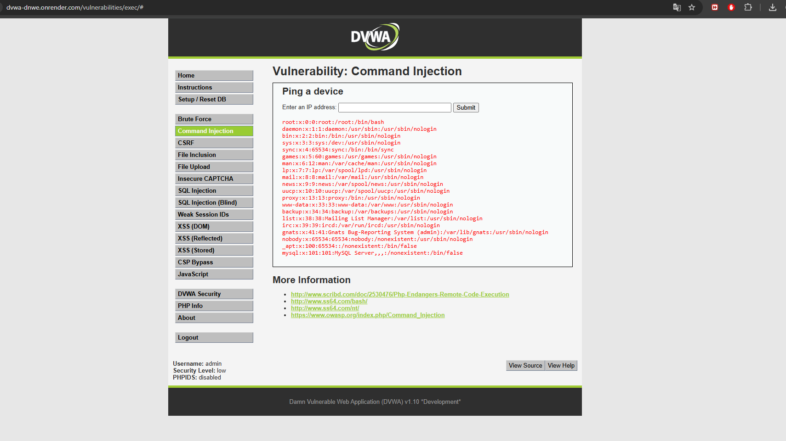

# Vulnerabilidad: Command Injection

# Clínica Vista Hermosa

---

# 1. Identificación del Hallazgo

| Campo                        | Detalle                                                                    |
| ---------------------------- | -------------------------------------------------------------------------- |
| Nombre de la vulnerabilidad  | Command Injection                                                          |
| Nombre en español            | Inyección de Comandos                                                      |
| Tipo de vulnerabilidad       | Ejecución de comandos del sistema operativo                                |
| Entorno de prueba            | DVWA                                                                       |
| Nivel de seguridad utilizado | Low                                                                        |
| Empresa evaluada             | Clínica Vista Hermosa                                                      |
| Rubro                        | Salud privada                                                              |
| Activos afectados            | Servidores, sistemas clínicos, bases de datos, infraestructura tecnológica |
| Severidad técnica estimada   | Crítica                                                                    |
| Riesgo para el negocio       | Crítico                                                                    |

---

# 2. Descripción General

La vulnerabilidad **Command Injection** o **Inyección de Comandos** corresponde a una falla de seguridad que permite a un atacante ejecutar comandos del sistema operativo a través de una aplicación web vulnerable.

Este tipo de vulnerabilidad ocurre cuando una aplicación recibe datos ingresados por el usuario y los incorpora directamente en comandos ejecutados por el servidor, sin aplicar validación estricta, filtrado adecuado ni restricciones de seguridad.

A diferencia de vulnerabilidades como XSS, que afectan principalmente al navegador del usuario, Command Injection puede afectar directamente al servidor donde se ejecuta la aplicación. Esto la convierte en una vulnerabilidad de alto impacto, ya que puede permitir acceso a archivos del sistema, ejecución de instrucciones no autorizadas, modificación de información, interrupción de servicios o incluso compromiso completo de la infraestructura.

En el contexto de **Clínica Vista Hermosa**, esta vulnerabilidad representa un riesgo extremadamente grave, debido a que los servidores institucionales podrían soportar el portal de pacientes, sistemas de gestión clínica, bases de datos médicas y servicios administrativos relacionados con la atención de salud.

---

# 3. Objetivo de la Prueba

El objetivo de esta prueba fue demostrar que una aplicación web vulnerable puede ejecutar comandos del sistema operativo a partir de una entrada manipulada por el usuario.

La prueba se realizó en un entorno controlado mediante DVWA, con fines académicos y defensivos. La finalidad fue comprender el funcionamiento de la vulnerabilidad, documentar evidencia y analizar sus consecuencias en una organización ficticia del sector salud.

---

# 4. Alcance de la Prueba

La prueba se limitó exclusivamente al módulo **Command Injection** de DVWA.

No se realizaron pruebas sobre servidores reales, infraestructura productiva, sistemas externos ni datos reales de pacientes.

El ejercicio se desarrolló únicamente dentro de un ambiente autorizado y deliberadamente vulnerable, con el propósito de demostrar el riesgo y proponer medidas de prevención, mitigación y recuperación.

---

# 5. Evidencia del Ataque

## 5.1 Payload utilizado

```bash
127.0.0.1; cat /etc/passwd
```

## 5.2 Captura de evidencia



**Figura 3.** Evidencia de explotación Command Injection en DVWA. Se observa la ejecución de comandos del sistema operativo desde la aplicación vulnerable, demostrando que la entrada del usuario fue interpretada como una instrucción del servidor.

## 5.3 Resultado obtenido

Al ingresar el payload en el campo vulnerable, la aplicación ejecutó el comando enviado y mostró información proveniente del sistema operativo.

El resultado demuestra que la aplicación no trató la entrada del usuario únicamente como un dato, sino que permitió que fuera interpretada como parte de una instrucción ejecutada por el servidor.

En un entorno real, este comportamiento podría permitir que un atacante ejecute comandos adicionales, explore archivos del sistema, revise configuraciones, obtenga información sensible o afecte la disponibilidad del servicio.

---

# 6. Explicación Técnica

## 6.1 Funcionamiento normal esperado

Algunas aplicaciones web utilizan comandos del sistema operativo para realizar tareas específicas, como verificar conectividad, consultar información del sistema o ejecutar procesos internos.

Por ejemplo, una aplicación podría ejecutar un comando similar a:

```bash
ping 127.0.0.1
```

En un funcionamiento seguro, el usuario solo debería poder ingresar una dirección IP o nombre de host válido, y la aplicación debería validar que la entrada corresponda estrictamente al formato esperado.

## 6.2 Funcionamiento vulnerable

La vulnerabilidad aparece cuando la aplicación incorpora directamente la entrada del usuario dentro del comando del sistema.

Si el usuario ingresa:

```bash
127.0.0.1; cat /etc/passwd
```

el sistema puede interpretar el carácter `;` como un separador de comandos.

Esto provoca que el servidor ejecute más de una instrucción:

```bash
ping 127.0.0.1
cat /etc/passwd
```

El primer comando corresponde a la funcionalidad esperada, pero el segundo comando fue agregado por el atacante. Esto demuestra que la aplicación permite ejecutar instrucciones no autorizadas en el sistema operativo.

## 6.3 Causa raíz

La causa raíz de Command Injection es la falta de separación entre:

* Entrada entregada por el usuario.
* Comandos ejecutados por el servidor.
* Lógica interna de la aplicación.

Cuando una aplicación confía en datos externos y los ejecuta sin validación estricta, permite que un atacante modifique el comportamiento del sistema.

Esta vulnerabilidad refleja una práctica insegura: utilizar directamente datos del usuario dentro de instrucciones del sistema operativo.

---

# 7. Clasificación de la Vulnerabilidad

Command Injection se clasifica como una vulnerabilidad de ejecución de comandos del sistema operativo.

Esta categoría es considerada crítica porque puede permitir que un atacante interactúe directamente con el entorno donde se ejecuta la aplicación.

Sus consecuencias pueden incluir:

* Lectura de archivos del sistema.
* Enumeración de usuarios.
* Ejecución de procesos no autorizados.
* Alteración de archivos.
* Interrupción de servicios.
* Instalación de software malicioso.
* Movimiento lateral hacia otros sistemas.
* Compromiso completo del servidor.

---

# 8. Activos Afectados

En Clínica Vista Hermosa, la explotación de Command Injection podría comprometer activos críticos de alto valor.

| Activo                      | Descripción                                          | Impacto Potencial                              |
| --------------------------- | ---------------------------------------------------- | ---------------------------------------------- |
| Servidores institucionales  | Equipos que alojan aplicaciones y servicios internos | Compromiso total del sistema                   |
| Portal de pacientes         | Plataforma de acceso para usuarios externos          | Caída del servicio o manipulación              |
| Base de datos clínica       | Repositorio de información médica                    | Acceso indirecto o exposición                  |
| Sistemas clínicos internos  | Aplicaciones usadas por médicos y administrativos    | Interrupción operacional                       |
| Credenciales de sistema     | Cuentas internas del servidor                        | Escalamiento de privilegios                    |
| Infraestructura tecnológica | Red, servicios y componentes asociados               | Movimiento lateral y propagación del incidente |

---

# 9. Impacto para Clínica Vista Hermosa

## 9.1 Impacto sobre la confidencialidad

La confidencialidad podría verse gravemente comprometida, ya que un atacante con capacidad de ejecutar comandos podría acceder a archivos, configuraciones, credenciales o rutas internas del sistema.

En una clínica privada, esto podría derivar en la exposición de:

* Fichas clínicas.
* Diagnósticos médicos.
* Resultados de exámenes.
* Datos personales.
* Credenciales internas.
* Configuraciones de bases de datos.
* Registros de actividad.

La exposición de esta información afectaría directamente la privacidad de los pacientes y la confianza en la institución.

## 9.2 Impacto sobre la integridad

La integridad también se vería afectada si el atacante logra modificar archivos, alterar configuraciones o manipular sistemas relacionados con la atención clínica.

Ejemplos de afectación:

* Modificación de archivos del portal.
* Alteración de configuraciones.
* Manipulación de registros.
* Cambios en servicios internos.
* Alteración de información clínica si se accede a sistemas relacionados.

En el sector salud, la integridad de la información es esencial, ya que los datos clínicos respaldan decisiones médicas y administrativas.

## 9.3 Impacto sobre la disponibilidad

La disponibilidad podría verse severamente afectada si el atacante detiene servicios, elimina archivos, sobrecarga recursos o interrumpe procesos críticos.

Esto podría provocar:

* Caída del portal de pacientes.
* Interrupción de sistemas clínicos.
* Imposibilidad de acceder a resultados de exámenes.
* Retrasos en la atención.
* Afectación de procesos administrativos.
* Costos de recuperación de emergencia.

---

# 10. Escenario de Riesgo para el Negocio

Un escenario posible sería que un atacante utilice un formulario vulnerable del portal de clientes para ejecutar comandos en el servidor.

A partir de esa ejecución, podría obtener información del sistema, identificar rutas internas, revisar configuraciones, comprometer credenciales o afectar servicios críticos.

En el caso de Clínica Vista Hermosa, esto podría impactar directamente en:

* Continuidad de la atención médica.
* Acceso de pacientes al portal.
* Disponibilidad de información clínica.
* Operación de sistemas administrativos.
* Confianza de pacientes y funcionarios.
* Costos de respuesta y recuperación.
* Daño reputacional.

Este riesgo se considera crítico porque puede afectar simultáneamente el servidor, las aplicaciones, los datos y la operación institucional.

---

# 11. Consecuencias Organizacionales

## 11.1 Consecuencias operacionales

* Interrupción del portal de pacientes.
* Caída de servicios clínicos digitales.
* Retraso en consultas de información médica.
* Afectación de procesos administrativos.
* Necesidad de suspender temporalmente sistemas comprometidos.

## 11.2 Consecuencias legales y normativas

* Investigación por exposición de datos sensibles.
* Posibles sanciones por falta de controles adecuados.
* Obligación de notificar incidentes según políticas internas o regulaciones aplicables.
* Riesgo de reclamos de pacientes afectados.

## 11.3 Consecuencias económicas

* Costos de recuperación tecnológica.
* Contratación de soporte especializado.
* Pérdida de continuidad operacional.
* Inversión urgente en controles de seguridad.
* Posible pérdida de clientes o pacientes.

## 11.4 Consecuencias reputacionales

* Pérdida de confianza de pacientes.
* Daño a la imagen institucional.
* Percepción de inseguridad del portal.
* Desconfianza por parte de médicos, funcionarios y usuarios externos.

---

# 12. Evaluación CVSS

## 12.1 Métrica Base Utilizada

| Métrica             | Valor   | Justificación                                                                 |
| ------------------- | ------- | ----------------------------------------------------------------------------- |
| Attack Vector       | Network | La vulnerabilidad puede explotarse desde una aplicación web accesible por red |
| Attack Complexity   | Low     | La explotación requiere una entrada simple                                    |
| Privileges Required | None    | No requiere privilegios especiales en el escenario evaluado                   |
| User Interaction    | None    | No requiere que otra víctima interactúe                                       |
| Scope               | Changed | La explotación puede afectar componentes más allá de la aplicación vulnerable |
| Confidentiality     | High    | Puede permitir acceso a información sensible del sistema                      |
| Integrity           | High    | Puede permitir modificación de archivos o configuraciones                     |
| Availability        | High    | Puede permitir interrupción de servicios                                      |

## 12.2 Vector CVSS

```text
CVSS:3.1/AV:N/AC:L/PR:N/UI:N/S:C/C:H/I:H/A:H
```

## 12.3 Puntaje CVSS

```text
10.0 / 10
```

## 12.4 Severidad

```text
CRÍTICA
```

## 12.5 Justificación de severidad

La severidad se considera crítica debido a que la vulnerabilidad permite ejecución de comandos del sistema operativo. Esto puede entregar al atacante una capacidad de acción mucho más amplia que otras vulnerabilidades web, afectando no solo la aplicación, sino también el servidor y potencialmente otros sistemas asociados.

En el contexto de una clínica privada, esta severidad se incrementa desde el punto de vista del negocio, debido a que los sistemas afectados pueden apoyar procesos de atención médica y almacenamiento de información sensible.

---

# 13. Relación con la Matriz de Riesgo

| Elemento                 | Evaluación       |
| ------------------------ | ---------------- |
| Probabilidad             | 5 - Muy Alta     |
| Impacto                  | 5 - Muy Alto     |
| Resultado                | 25               |
| Nivel de riesgo          | Crítico          |
| Prioridad de tratamiento | Máxima prioridad |

La probabilidad se considera muy alta porque el ataque fue ejecutado exitosamente mediante un payload simple. El impacto se considera muy alto porque la explotación puede comprometer el servidor y afectar la continuidad operacional de la clínica.

---

# 14. Políticas de Prevención

Las políticas de prevención buscan eliminar la causa raíz de la vulnerabilidad y evitar que entradas de usuario sean ejecutadas como comandos del sistema.

## 14.1 Evitar ejecución directa de comandos del sistema

La aplicación debe evitar ejecutar comandos del sistema operativo cuando existan alternativas seguras dentro del lenguaje o framework utilizado.

Por ejemplo, en lugar de llamar directamente a comandos del sistema, se deben utilizar bibliotecas internas que realicen la función requerida sin invocar una shell.

## 14.2 Validación estricta de entradas

Toda entrada del usuario debe validarse mediante listas blancas.

Si el sistema espera una dirección IP, debe aceptar únicamente caracteres válidos para ese formato.

Ejemplo de criterios:

* Solo números.
* Solo puntos.
* Longitud máxima definida.
* Rechazo de caracteres especiales.
* Rechazo de separadores de comandos.

## 14.3 Lista blanca de valores permitidos

Siempre que sea posible, la aplicación debe permitir únicamente valores predefinidos.

Este enfoque es más seguro que intentar bloquear caracteres peligrosos, ya que reduce la posibilidad de evasión.

## 14.4 No invocar shell innecesariamente

La aplicación no debe ejecutar comandos mediante una shell cuando no sea estrictamente necesario.

Invocar una shell aumenta el riesgo de que caracteres especiales sean interpretados como instrucciones adicionales.

## 14.5 Principio de menor privilegio

El servicio web debe ejecutarse con permisos mínimos.

No debe ejecutarse como administrador, root ni con cuentas que tengan acceso amplio al sistema.

## 14.6 Separación de funciones

Las funciones que requieren interacción con el sistema operativo deben estar separadas, controladas y monitoreadas, evitando que sean accesibles directamente desde formularios públicos.

---

# 15. Controles de Mitigación

Los controles de mitigación buscan reducir el impacto en caso de que exista la vulnerabilidad o se detecte un intento de explotación.

## 15.1 Web Application Firewall

Implementar reglas de WAF que detecten patrones de Command Injection, como separadores de comandos, operadores encadenados y caracteres especiales sospechosos.

## 15.2 Monitoreo de comandos y procesos

Registrar y analizar procesos ejecutados por el servidor web.

Se deben monitorear eventos como:

* Ejecución de comandos inusuales.
* Procesos generados por el usuario del servidor web.
* Uso anormal de CPU o memoria.
* Acceso a archivos sensibles.
* Intentos de lectura de archivos del sistema.

## 15.3 IDS e IPS

Implementar sistemas de detección y prevención de intrusiones para identificar actividad maliciosa en servidores y red.

## 15.4 Segmentación de red

Separar servidores web, bases de datos y sistemas clínicos en segmentos distintos.

Esto reduce el impacto si un atacante compromete un componente.

## 15.5 Hardening del servidor

Aplicar configuración segura en el servidor, eliminando servicios innecesarios, restringiendo permisos y reduciendo superficie de ataque.

## 15.6 Gestión de logs

Mantener registros detallados de actividad del sistema, accesos, errores, ejecución de procesos y cambios relevantes.

## 15.7 Respaldos verificados

Mantener respaldos periódicos, cifrados y probados para garantizar recuperación frente a alteración, eliminación o compromiso del servidor.

---

# 16. Marcos de Referencia Aplicables

## 16.1 OWASP

OWASP considera las fallas de inyección como riesgos críticos para aplicaciones web. Las recomendaciones principales incluyen validación de entradas, uso de APIs seguras, separación entre datos e instrucciones y reducción de privilegios.

## 16.2 NIST

El marco NIST promueve funciones de identificación, protección, detección, respuesta y recuperación. Para Command Injection, son relevantes los controles de protección de sistemas, detección de actividad anómala, respuesta ante incidentes y recuperación operacional.

## 16.3 CIS Controls

Los controles CIS recomiendan gestión segura de configuraciones, control de privilegios, monitoreo de logs, protección contra malware, administración de vulnerabilidades y recuperación de datos.

---

# 17. Plan de Respuesta ante Incidente

Si se detecta una explotación de Command Injection en Clínica Vista Hermosa, se recomienda ejecutar el siguiente procedimiento:

## 17.1 Identificación

* Confirmar la actividad sospechosa.
* Revisar logs del servidor.
* Identificar comandos ejecutados.
* Determinar cuentas afectadas.
* Verificar si hubo acceso a información sensible.

## 17.2 Contención

* Aislar el servidor afectado.
* Bloquear tráfico sospechoso.
* Deshabilitar temporalmente la funcionalidad vulnerable.
* Revocar credenciales potencialmente comprometidas.
* Restringir accesos administrativos.

## 17.3 Erradicación

* Corregir la vulnerabilidad en el código.
* Eliminar archivos maliciosos si existen.
* Aplicar parches pendientes.
* Revisar configuraciones inseguras.
* Fortalecer permisos del servicio web.

## 17.4 Recuperación

* Restaurar sistemas desde respaldos confiables si corresponde.
* Validar integridad de archivos.
* Verificar funcionamiento de servicios clínicos.
* Rehabilitar el sistema de forma controlada.
* Monitorear actividad posterior a la recuperación.

## 17.5 Lecciones aprendidas

* Documentar el incidente.
* Actualizar procedimientos internos.
* Mejorar controles preventivos.
* Capacitar al equipo técnico.
* Realizar nuevas pruebas de seguridad.

---

# 18. Recomendaciones Técnicas

Para corregir y reducir el riesgo de Command Injection se recomienda:

1. Eliminar llamadas directas a comandos del sistema cuando no sean necesarias.
2. Utilizar APIs seguras del lenguaje de programación.
3. Validar entradas mediante listas blancas.
4. Rechazar caracteres de control y separadores de comandos.
5. Ejecutar servicios con permisos mínimos.
6. Segmentar servidores web, bases de datos y sistemas clínicos.
7. Implementar WAF con reglas específicas.
8. Monitorear procesos ejecutados por el servidor web.
9. Mantener logs centralizados.
10. Realizar pruebas de seguridad posteriores a la corrección.
11. Aplicar hardening del sistema operativo.
12. Mantener respaldos verificados y disponibles.

---

# 19. Plan de Acción Propuesto

| Prioridad | Acción                                             | Responsable sugerido        | Plazo         |
| --------- | -------------------------------------------------- | --------------------------- | ------------- |
| Crítica   | Deshabilitar o corregir la función vulnerable      | Equipo de desarrollo        | Inmediato     |
| Crítica   | Eliminar ejecución directa de comandos del sistema | Equipo de desarrollo        | Inmediato     |
| Alta      | Aplicar validación por lista blanca                | Equipo de desarrollo        | Corto plazo   |
| Alta      | Reducir privilegios del servicio web               | Infraestructura / Seguridad | Corto plazo   |
| Alta      | Revisar logs y comandos ejecutados                 | Equipo TI / Seguridad       | Corto plazo   |
| Media     | Implementar reglas WAF específicas                 | Seguridad / Infraestructura | Mediano plazo |
| Media     | Segmentar servidor web y sistemas clínicos         | Infraestructura             | Mediano plazo |
| Media     | Ejecutar pruebas de seguridad periódicas           | Auditoría / Seguridad       | Permanente    |

---

# 20. Evidencia Esperada para la Entrega

Para cumplir correctamente con la evaluación, la evidencia debe mostrar:

* Módulo Command Injection de DVWA.
* Payload ingresado.
* Resultado obtenido.
* Ejecución visible del comando.
* Captura propia guardada como `comandos_anajul.png`.
* Imagen insertada en la carpeta `docs_anajul/img_anajul/`.

Ruta esperada:

```text
docs_anajul/img_anajul/comandos_anajul.png
```

Referencia dentro del Markdown:

```markdown

```

---

# 21. Conclusión

Command Injection representa una de las vulnerabilidades más críticas evaluadas durante esta auditoría, debido a que permite ejecutar comandos directamente sobre el sistema operativo del servidor.

En el contexto de Clínica Vista Hermosa, la explotación exitosa de esta vulnerabilidad podría comprometer servidores institucionales, sistemas clínicos, bases de datos, credenciales internas y servicios esenciales para la continuidad operacional.

A diferencia de otras vulnerabilidades web, Command Injection puede entregar al atacante una capacidad de acción amplia sobre la infraestructura tecnológica, aumentando el riesgo de exposición de información médica, alteración de sistemas e interrupción de servicios.

Por esta razón, su tratamiento debe ser inmediato y prioritario. La organización debe eliminar la ejecución insegura de comandos, aplicar validación estricta, reducir privilegios, segmentar sistemas, monitorear procesos y establecer un plan de respuesta ante incidentes.

Desde una perspectiva de negocio, esta vulnerabilidad representa un riesgo crítico para la continuidad de la atención médica, la protección de datos sensibles y la confianza de pacientes y funcionarios en la institución.
